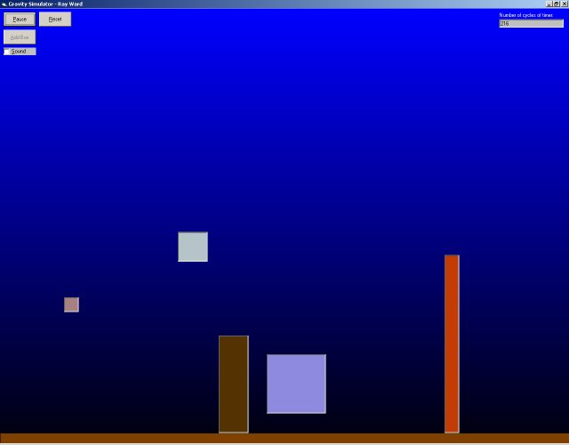



## Gravity Simulator

### Description

An engine using real physics equations that moves and bounces picture boxes under a realistic gravity environment. Includes collision detection to stack boxes and features add/remove boxes and to set invidual properties for each box. Also demonstrates use of arrays and types. Some commentation where nescessary. Also please take the time to vote :)
 
### More Info
 

             |
---                |---
**Submitted On**   |2002-03-01 21:13:06
**By**             |[Ray Ward](https://github.com/Planet-Source-Code/PSCIndex/blob/master/ByAuthor/ray-ward.md)
**Level**          |Intermediate
**User Rating**    |4.2 (25 globes from 6 users)
**Compatibility**  |VB 5\.0, VB 6\.0
**Category**       |[Miscellaneous](https://github.com/Planet-Source-Code/PSCIndex/blob/master/ByCategory/miscellaneous__1-1.md)
**World**          |[Visual Basic](https://github.com/Planet-Source-Code/PSCIndex/blob/master/ByWorld/visual-basic.md)
**Archive File**   |[Gravity\_Si58520312002\.zip](https://github.com/Planet-Source-Code/ray-ward-gravity-simulator__1-32214/archive/master.zip)

